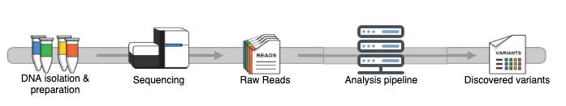

# Next Generation Sequencing Quality metric analysis

The genetics department of the UMCG deals with all aspects of heredity, both in the field of patient care and scientific research. Approximately 15,000 genetic tests are run per year. For these analysis the UMCG makes use of next-generation sequencing (NGS) for diagnostics or research purposes. To ensure the quality of the tests, one metric, coverage, is used to validate the quality for a specific sample. 

Samples have lots of quality information that is produced during and after sequencing. This data might have a correlations with the success of analysis. We want to find the values that have effects on the quality and results so we can track these changes and for example inform about new methods that cause sudden changes to prevent unusable or bad results.

The many steps in the process provide us with lots of data, stored in different formats and locations, some are filled by laboratory technicians, others are produced by software tools and machines, and produced at different intervals in the process. 


## Goal
The goal of the project is to assess the different metrics produced at the intervals in the NGS process and identify metrics that can improve or supplement quality assesment at the different intervals

* Find predictive values by correlating metrics
* Develop a model to identify possible important metrics
* construct a list of metrics to asses using the model and correlating metrics
* Test the effects of hte metrics in the list, to accept or dismiss their importantce.

## Repo structure

| Folder                               | Contains                                                                                     |
| ------------------------------------ | -------------------------------------------------------------------------------------------- |
| src/scripts                          | Data aqusition scripts                                                                       |
| src/scripts/bash                     | bash scripts to start data aqusition                                                         |
| src/scripts/python                   | Python scripts to parse metric files                                                         |
| src/scripts/python/QualityParser     | QualityParser module written for project, contains parsers for metric files                  |
| src/scripts/python/ExecutableScripts | Executable python scripts that use the QualityParser module                                  |
| src/scripts/SQL                      | SQLite scheme used for data storage                                                          |
| docs                                 | R markdown logbooks, contains analysis procedures                                            |
| img                                  | Images                                                                                       |

## Data Parsers 

For the study a python module called `QualityParser` was developed. The module was used in pair with SQLite, and bash to store most avaialable metrics.

### Using QualityParser

```sh
python2 setup.py install 
```

```python
import QualityParser as QP

QP.parseAlignmentSummaryMetrics(AlignmentSummaryMetricsFile)
```
other parsers:
* parseAlignmentSummaryMetirics
* parseFlagstatFile
* parseGcBiasFile
* parseHsMetricsFile
* parseInserSizeMetricsFile
* QBCparser
* parseQDM

Each parser parses the files to its respective Datatype in `QualityParser/DataTypes` and can be stored to a SQLite database file using:
```python
db = QP.sqlite3Database('path/to/database.sqlite')

db.addHsMetric(hsMetric)
```

other possible store functions:
* addSequencingRun
* addSample
* addProject
* addSequencer
* addCapturingKit
* addAlignmentSummaryEntry
* addFlagstatEntry
* addGCbiasEntry
* addHsMetric
* addInsertSizeEntry
* addQualityDistribution
* addQualityByCycle
* addRunSummary

## Analisis Procedures

The analysis of the data gathered with the scripts can be found in the `docs`folder
* DataAnalysis.Rmd: Exploratory phase of data analysis
* Correlations.Rmd:  Quick correlation analysis of the many metrics
* gradientBoosting.Rmd: gradient boositng models to determine a list of metrics
* AnalysisLog.Rmd: Grouping of the different Rmd files as one easy package

## License
GNU Lesser General Public License v3.0. See `LICENSE` for more information.

## Contact

Jouke Profijt - jouke.profijt@gmail.com
Project - [link](https://github.com/jprofijt/analysis-metrics-prediction-display)

